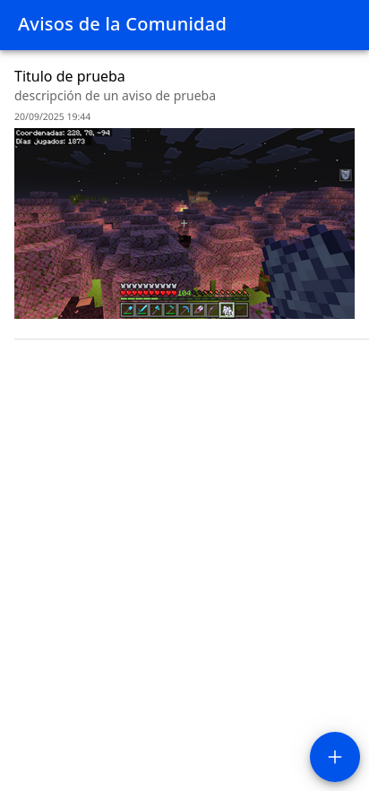

# PeorEsNada

Este proyecto es una aplicación móvil desarrollada con Ionic y Angular, diseñada para gestionar avisos comunitarios. Permite a los usuarios crear, visualizar y eliminar avisos, incluyendo la opción de adjuntar una imagen.

## Características

*   **Creación de Avisos:** Añade nuevos avisos con título, descripción e imagen opcional.
*   **Listado de Avisos:** Visualiza todos los avisos creados.
*   **Eliminación de Avisos:** Desliza un aviso para eliminarlo de la lista.
*   **Almacenamiento Local:** Los avisos se guardan localmente en el dispositivo utilizando Capacitor Preferences.
*   **Integración con Cámara/Galería:** Permite adjuntar imágenes a los avisos directamente desde la cámara o la galería del dispositivo.

## Screenshots de la aplicación en navegador





https://github.com/user-attachments/assets/f88ff8f4-5bac-474d-ac5c-174648b45dc3


## Instalación de Dependencias

Para configurar el entorno de desarrollo y ejecutar el proyecto, sigue los siguientes pasos:

1.  **Clonar el repositorio:**
    ```bash
    git clone https://github.com/clairerb6/peoresnada.git
    cd peoresnada
    ```

2.  **Instalar Node.js y npm:**
    Asegúrate de tener Node.js (versión 18 o superior) y npm (versión 9 o superior) instalados en tu sistema. Puedes descargarlos desde [nodejs.org](https://nodejs.org/).

3.  **Instalar Ionic CLI y Capacitor CLI (si no los tienes):**
    ```bash
    npm install -g @ionic/cli @capacitor/cli
    ```

4.  **Instalar las dependencias del proyecto:**
    Navega a la raíz del proyecto y ejecuta:
    ```bash
    npm install
    ```

5.  **Configurar la plataforma Android (si es la primera vez):**
    ```bash
    npx cap add android
    ```
    Si ya la tienes, puedes omitir este paso.

## Uso de la Aplicación

La aplicación "PeoresNada" te permite gestionar avisos de la siguiente manera:

*   **Ver Avisos:** Al iniciar la aplicación, verás una lista de todos los avisos existentes. Si no hay ninguno, se te indicará que crees el primero.
*   **Crear un Nuevo Aviso:**
    1.  Haz clic en el botón flotante de `+` (añadir) en la esquina inferior derecha.
    2.  Rellena el título y la descripción del aviso.
    3.  Opcionalmente, puedes adjuntar una imagen haciendo clic en el icono de la cámara. Podrás elegir entre tomar una foto con la cámara o seleccionar una de tu galería.
    4.  Haz clic en "Guardar Aviso" para añadirlo a la lista.
*   **Eliminar un Aviso:**
    1.  En la lista de avisos, desliza el elemento que deseas eliminar hacia la izquierda.
    2.  Aparecerá un botón de "Eliminar" con un icono de papelera.
    3.  Haz clic en el botón "Eliminar".
    4.  Se te pedirá una confirmación antes de eliminar el aviso permanentemente.

## Exportar a un Dispositivo Android

Para ejecutar la aplicación en un dispositivo Android conectado (con depuración USB habilitada y autorización concedida), sigue estos pasos:

1.  **Compilar la aplicación web:**
    Este comando compila el proyecto de Angular y genera los archivos estáticos optimizados en la carpeta `www`.
    ```bash
    ionic build
    ```

2.  **Sincronizar los recursos web con el proyecto Android:**
    Este comando copia los archivos compilados de la aplicación web a la carpeta `assets/public` del proyecto Android nativo.
    ```bash
    npx cap sync
    ```

3.  **Ejecutar la aplicación en el dispositivo Android:**
    Este comando construye el proyecto Android y lo despliega en tu dispositivo conectado. Si tienes varios dispositivos, se te pedirá que selecciones uno.
    ```bash
    npx cap run android
    ```
    **Alternativa (especificando el dispositivo):**
    Si conoces el ID de tu dispositivo (puedes obtenerlo con `adb devices`), puedes ejecutarlo directamente:
    ```bash
    npx cap run android --target=ID_DE_TU_DISPOSITIVO
    ```
    *(Reemplaza `ID_DE_TU_DISPOSITIVO` con el ID real de tu dispositivo, por ejemplo, `ZY22JX2Q41`)*

---

**Nota:** Recuerda que para la depuración en Android, debes tener el SDK de Android configurado y las variables de entorno `ANDROID_HOME` y `PATH` correctamente establecidas.
